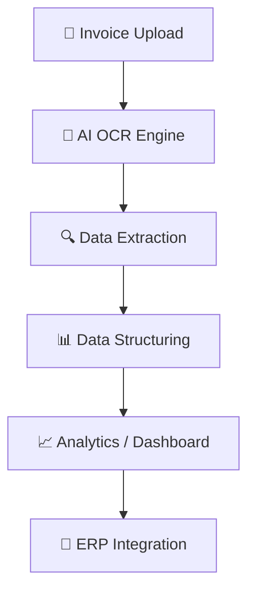

# 📄 AI-Powered Invoice Processing System using Nanonets OCR

<p align="center">
  
  
  
  
</p>

<p align="center">
  
  
  
</p>

<p align="center">
🚀 Transforming Manual Invoice Processing into Intelligent Automation
</p>

---

## ✨ Why This Project Stands Out

> 💡 This is not just OCR — it's a **complete AI-driven financial automation pipeline**

✔ Converts unstructured invoices into structured datasets
✔ Eliminates repetitive manual tasks
✔ Enables real-time financial insights
✔ Designed with scalability in mind

---

## 📌 Overview

This project demonstrates how **Artificial Intelligence + OCR** can automate invoice processing using **Nanonets**, turning raw invoice documents into **clean, structured, and analysis-ready data**.

It bridges the gap between **manual accounting workflows** and **intelligent finance systems**.

---

## 🎯 Objectives

* 🔍 Automate invoice data extraction
* 📊 Structure unorganized financial documents
* ⚡ Improve processing speed
* 🎯 Increase accuracy
* 🔗 Enable analytics and system integration

---

## 🚨 Problem vs Solution

| 🚨 Traditional System | ✅ AI-Based System    |
| --------------------- | -------------------- |
| Manual data entry     | Automated extraction |
| High error rate       | High accuracy        |
| Slow processing       | Real-time processing |
| Not scalable          | Fully scalable       |

---

## 🏗️ System Architecture



---

## ⚙️ Workflow Breakdown

```text
Input Invoice → OCR Processing → Field Detection → Data Cleaning → Structured Output → Analysis
```

---

## 🧠 Intelligent Data Extraction

The system automatically extracts:

* 📄 Invoice Number
* 🏢 Vendor Name
* 📅 Invoice Date
* 💰 Total Amount
* 📊 Line Items (if available)

---

## 📸 Screenshots

### 🖥️ Model Interface


---

### 📊 Extracted Data Output


---

### 🧠 Training & Field Detection


---

### 📄 Processed Invoice


---

### 📑 Final Structured Data


---

## 🛠️ Tech Stack

| Layer           | Technology             |
| --------------- | ---------------------- |
| 🤖 AI Engine    | Nanonets OCR           |
| 🧠 Intelligence | Machine Learning       |
| 🖼️ Input       | Image / PDF Processing |
| 📊 Output       | CSV / JSON             |

---

## 📊 Performance Highlights

| Metric              | Result                    |
| ------------------- | ------------------------- |
| ⏱️ Processing Speed | ↑ Faster than manual      |
| 🎯 Accuracy         | High precision extraction |
| 👩‍💻 Manual Effort | ↓ Significantly reduced   |
| 📈 Scalability      | Supports bulk invoices    |

---

## 🌍 Real-World Impact

* 📑 Accounts Payable Automation
* 🏢 Enterprise Finance Systems
* 🔍 Audit & Compliance
* 📊 Business Intelligence Dashboards

---

## ⚡ Quick Start

```bash
# Upload invoice to Nanonets
# Run OCR model
# Extract structured data
# Export results (CSV / JSON)
```

---

## 🔮 Future Scope

* 🔗 Integration with ERP systems
* 🌐 API automation pipeline
* 🌍 Multi-language invoice support
* 🔍 AI-based anomaly detection
* 🤖 Auto-approval workflows

---

## 🧩 Innovation Highlights

✔ AI-driven document intelligence
✔ End-to-end automation pipeline
✔ Finance + AI integration
✔ Industry-relevant use case

---

## 🤝 Contributing

Want to improve this project?

1. Fork the repo
2. Create a feature branch
3. Commit changes
4. Submit a Pull Request

---

## 📜 License

MIT License — free to use and modify.

---

## 👩‍💼 Author

**Deeksha Bawa**
🎓 MBA Finance | 💡 AI in Finance Enthusiast

---

<p align="center">
🔥 Built with AI | Designed for Finance | Ready for the Future 🔥
</p>

<p align="center">
⭐ Star this repository if it impressed you!
</p>
